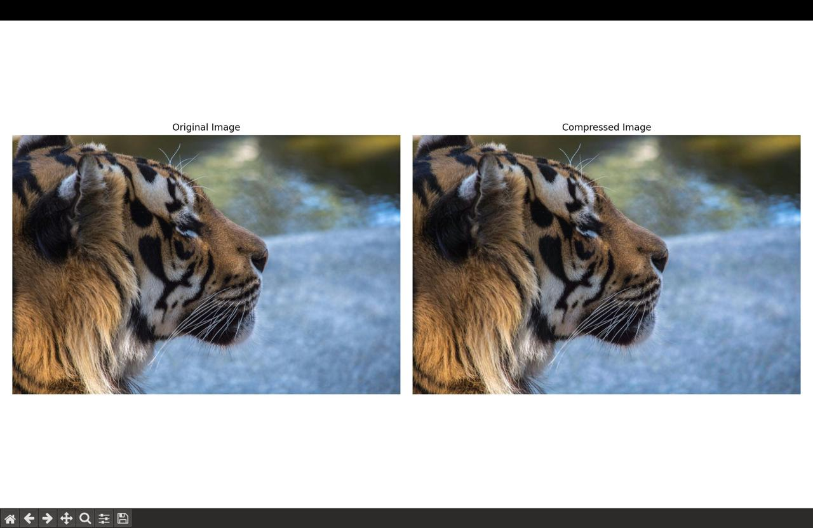
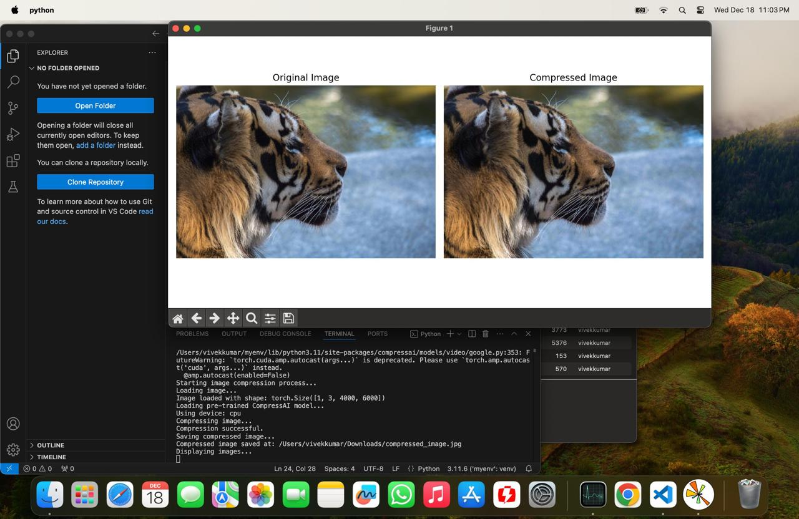

# ImageCompression-UsingAI
# AI-Driven Image Compression using CompressAI

## Overview
This project leverages deep learning techniques to compress images efficiently while maintaining high visual quality. The model used is `bmshj2018_factorized` from the CompressAI library, which is a pre-trained deep learning model designed for image compression.

## Features
- Uses a pre-trained deep learning model (`bmshj2018_factorized`) for image compression.
- Supports GPU acceleration for faster performance.
- Computes **Peak Signal-to-Noise Ratio (PSNR)** to measure image quality.
- Displays side-by-side comparison of the original and compressed images.
- Saves the compressed image for further use.

## Input vs. Output
### Original vs. Compressed Image
Below is a side-by-side comparison of an input image and its compressed version:




## Installation
Ensure you have Python installed, then install the required dependencies:

```bash
pip install torch torchvision compressai matplotlib pillow
```

## Usage
Run the script with an image file:

```bash
python compress_image.py
```

Modify `image_path` in the script to specify the input image.

## Code Breakdown
### 1. Load and Preprocess the Image
- Converts the input image to a tensor format suitable for the model.

### 2. Load Pre-Trained CompressAI Model
- Uses `bmshj2018_factorized` to compress the image.

### 3. Perform Image Compression
- Generates a compressed version of the input image while preserving key features.

### 4. Compute PSNR
- Evaluates image quality loss due to compression.

### 5. Display and Save Output
- Displays side-by-side comparison and saves the compressed image.

## Example Output
```bash
Starting image compression process...
Loading image...
Image loaded with shape: torch.Size([1, 3, 1024, 768])
Loading pre-trained CompressAI model...
Using device: cuda
Compressing image...
Compression successful.
Saving compressed image...
Compressed image saved at: /path_to/compressed_image.jpg
PSNR: 32.45 dB
```

## Results
| Metric        | Value |
|--------------|-------|
| Compression Ratio | ~X.XX |
| PSNR (dB)        | 32.45 |

## Future Work
- Experiment with different pre-trained models.
- Improve compression efficiency for high-resolution images.
- Implement real-time compression for streaming applications.


